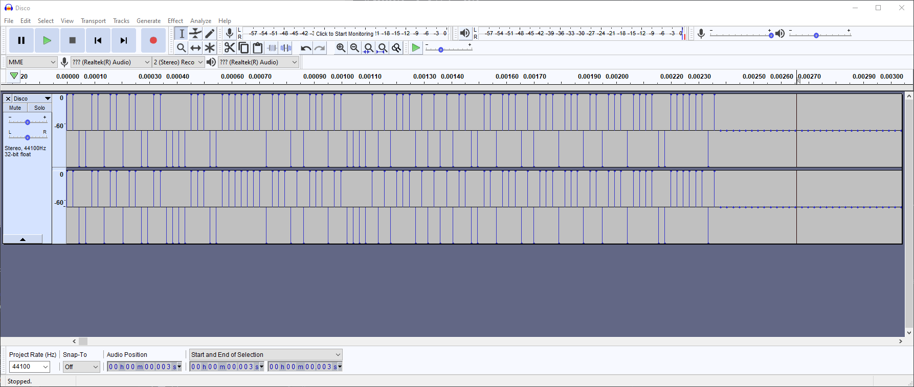
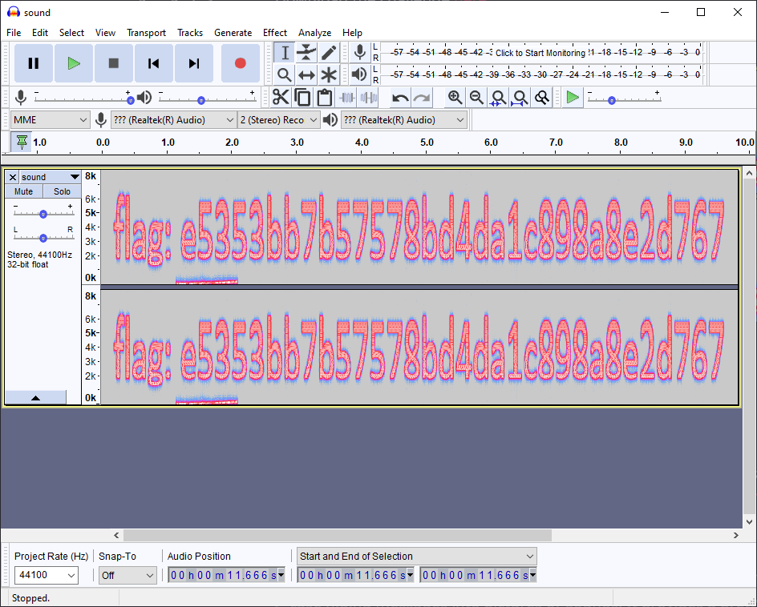

The audio-related CTF challenges mainly use steganography techniques, involving MP3, LSB, waveform, spectrum steganography.


## Common Method


Finding and extracting information using  `binwalk` and `strings` commands, details are not converted.


## MP3 Steganography


### Basics


MP3 steganography is using the [MP3stego](http://www.petitcolas.net/steganography/mp3stego/) tool to hide information. The basic introduction and usage are as follows:


> MP3Stego will hide information in MP3 files during the compression process. The data is first compressed, encrypted and then hidden in the MP3 bit stream.


```shell
encode -E hidden_text.txt -P pass svega.wav svega_stego.mp3
decode -X -P pass svega_stego.mp3
```


### ISCC-2016: Music Never Sleep


After the initial observation, no flag was found with `strings` and the audio was normal. so steganography tool was likely used to hide the flag.


After decoding using `Mp3Stego` with the password found earlier.


```shell
decode.exe -X ISCC2016.mp3 -P bfsiscc2016
```


We got the file `iscc2016.mp3.txt`:

```
Flag is SkYzWEk0M1JOWlNHWTJTRktKUkdJTVpXRzVSV0U2REdHTVpHT1pZPQ== ???
```

After decoding the encoded string from base64 and base32, we got the flag.


## Waveform


### Basics
--..----.----.

Generally speaking, we want to observe the waveform pattern of an audio file to find something strange. We can use tools like Audacity or Adobe Audition to do that. After the waveform pattern, see if you can convert part of the waveform into binary strings (1s and 0s). See


### ISCC-2017: Misc-04


In fact, the hidden information in this challenge is in the first part of the audio. If you don't listen carefully, you may mistake it for steganography.

> Download the challenge [here](https://github.com/ctf-wiki/ctf-challenges/blob/master/misc/audio/ISCC-2017-Disco.wav)





The high is 1, and the low is 0, representing a binary string (1s and 0s).

```
110011011011001100001110011111110111010111011000010101110101010110011011101011101110110111011110011111101
```

Convert to ASCII. Note that one group of binary must be 7 bits because the length of the binary string is 105, it can't divide into 8 bits evenly (105 mod 8 is 1), however, it does divide into 7 (105 mod 7 is 0).


## Spectrum


### Basics


Spectrum stenography is hiding strings in the audio spectrum. One distant feature is that it often contains noisy or harsh sounds.


### Su CTF Quals 2014: hear_with_your_eyes

> Download the challenge [here](https://github.com/ctf-wiki/ctf-challenges/blob/master/misc/audio/SharifCTF2014-Hear%20with%20your%20Eyes/sound.wav)

Open the audio in `Audacity`and view the spectrogram.





## LSB Audio Steganography


### Basics


Similar to LSB in image steganography, you can also perform LSB steganography in audio. we can use the SilentEye tool to solve audio LSB challenges.

Description of SilentEye:

> SilentEye is a cross-platform application design for an easy use of steganography, in this case hiding messages into pictures or sounds. It provides a pretty nice interface and an easy integration of new steganography algorithm and cryptography process by using a plug-ins system.


### 2015 GDQWB: Little Apple


Just use `slienteye`'s decode feature.


## Further Resources


- [LSB in Audio - DerbyCon CTF](https://ethackal.github.io/2015/10/05/derbycon-ctf-wav-steganography/)
- [Manchester code - Wikipedia](https://en.wikipedia.org/wiki/Manchester_code)
