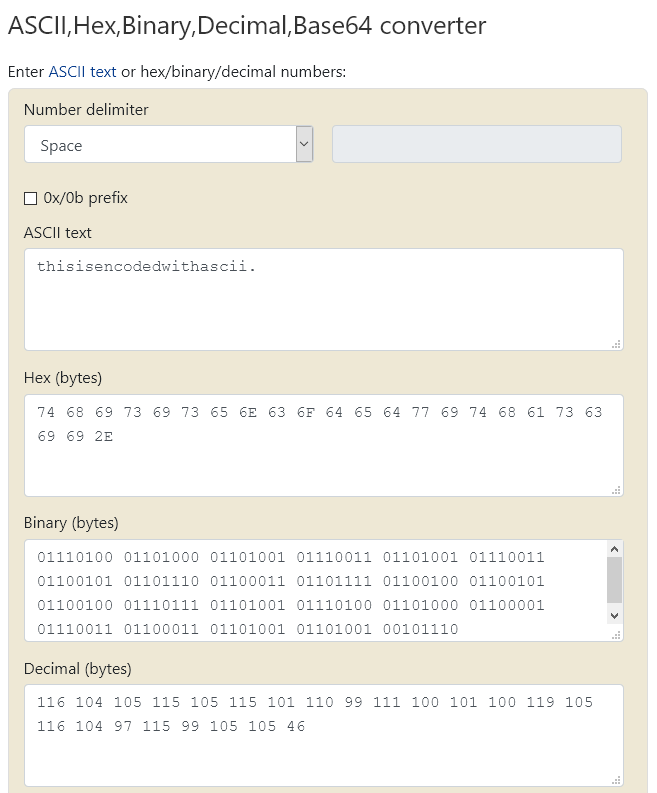
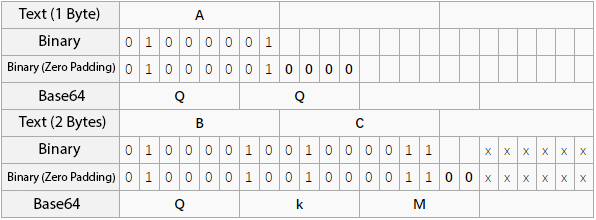

This section describes the different encoding used by a computer.


## Alphabet Encoding


- A-Z or a-z corresponds to 1-26 or 0-25


### Tools


- [Letter Numbers Converter](http://rumkin.com/tools/cipher/numbers.php)


## ASCII encoding


### Features


We use ASCII encoding for printable characters, such as the following:

- 0-9, 49-57

- A-Z, 65-90

- a-z, 97-122


### ASCII Conversion


#### Binary


Convert ASCII decimal to binary representation.

- Only contains 0 and 1
- No more than 8 bits, 7 bits are also possible because printable characters are up to 127
- Actually just another form of ASCII code


#### Hexadecimal


Convert letters to ASCII hexadecimal representation.

- A-Z → 41-5a
- a-z → 61-7a


### Tools


- [ASCII,Hex,Binary,Decimal,Base64 Converter](https://www.rapidtables.com/convert/number/ascii-hex-bin-dec-converter.html)


## CTF Examples





### 2018 DEFCON Quals - Ghettohackers: Throwback


The challenge details:

```
Anyo!e!howouldsacrificepo!icyforexecu!!onspeedthink!securityisacomm!ditytop!urintoasy!tem!
```

Here we split the given string by `!` mark, then the length of each string corresponds to a letter. For example, length 1 = a, length 2 = b, and so on.

```python
ori = 'Anyo!e!howouldsacrificepo!icyforexecu!!onspeedthink!securityisacomm!ditytop!urintoasy!tem!'
sp = ori.split('!')
# split original text by !
print(''.join(chr(97+len(s)-1) if s else ' ' for s in sp))
# get length of each word and add offset, then convert it to letter with chr()
```

We assumed that 0 characters are spaces because it makes the flag readable.

The flag is:
`dark logic`


## Base Encoding


the `xx` in base`xx` indicates how many characters are used for encoding.
For example, base64 uses 64 characters to encode since 2 to the sixth power is 64, each 6 bit is an element that corresponds to a printable character. Three bytes have 24 bits, corresponding to four Base64 elements, so three bytes are needed to represent four printable characters. The printable characters in Base64 include the letters A-Z, a-z, numbers 0-9 that are 62 characters and two printable characters differ in different systems.


[Base64 - Wikipedia](https://en.wikipedia.org/wiki/Base64).


Encoding the word  **man**:


If the numbers of bytes are not divisible by 3, there will be 1 or 2 extra bytes at the end.

- Fill the remaining with value 0 at the end so that it can be divisible by 3, then encode to base64.
- After it's encoded to base64, you need to add one or two `=` at the end. When there are 8 bits (one byte) remaining and the last 6 base64 bits contain four values of `0`, you need to add two `=` at the end. When there are two bytes remaining and the last 6 base64 bits contain two values of `0`, you need to add one `=` at the end.

Refer to the table below:


Because the zero paddings are not used in operation, hidden information can be stored there.


Similar to base64, base32 uses 32 characters to encode since 2 to the fifth power is 32, each 5 bit is an element that corresponds to a printable character.
- If there are less than 5 bit, fill it with `0` at the end.
- Fill the remaining with `=` until there are 5 bytes.
- Base32 can have up to six `=` at the end.

Refer to the table below:


### Features


- Base64 can have `=` at the end, but two maximum.
- Base64 can have `=` at the end, but six maximum.
- Characters set differ from different bases.
- **It may be necessary to manually add `=` sign**
- **`=` is also 3d (in hex)**
- For more details, see [Base RFC](https://tools.ietf.org/html/rfc4648)


### Tools


- [Base64 Decode](https://www.base64decode.org/)
- [Base64 Encode](https://www.base64encode.org/)
- Python `base64` library functions
- [Steganographic Script](https://github.com/cjcslhp/wheels/tree/master/b64stego)


### Examples


> The challenge details can be found in the **data.txt** file on [here](https://github.com/ctf-wiki/ctf-challenges/blob/master/misc/encode/computer/base64-stego/data.txt)

Use a script to read steganographic information:

```python

import base64

def deStego (stegoFile):
    b64table = "ABCDEFGHIJKLMNOPQRSTUVWXYZabcdefghijklmnopqrstuvwxyz0123456789+/"

    with open(stegoFile,'r') as stegoText:
        message = ""

        for line in stegoText:
            try:
                text = line[line.index("=") - 1:-1]
                message += "".join([ bin( 0 if i == '=' else b64table.find(i))[2:].zfill(6) for i in text])[2 if text.count('=') ==2 else 4:6]  
            except:
                pass

    return "".join([chr(int(message[i:i+8],2)) for i in range(0,len(message),8)])

print(deStego("text.txt"))
```

Output:
`flag{BASE64_i5_amaz1ng}`


## Huffman Coding


See [Hoffman Coding - Wikipedia](https://en.wikipedia.org/wiki/Huffman_coding)


## XXencoding


XXencode encodes the input text in units of three bytes. If the final remaining data is less than three bytes, the missing parts are filled out with zeros. These three bytes have 24 bits in total, divided into four groups of 6 bits, each of which is represented in decimal terms with values that only fall between 0 and 63. Replace the position character of the corresponding value.

```text

           1         2         3         4         5         6

 0123456789012345678901234567890123456789012345678901234567890123

 |         |         |         |         |         |         |

 +-0123456789ABCDEFGHIJKLMNOPQRSTUVWXYZabcdefghijklmnopqrstuvwxyz

```

See [Xxencoding - Wikipedia](https://en.wikipedia.org/wiki/Xxencoding)


### Features


- only contains numbers and uppercase/lowercase letters
- `-` sign, `-` sign


### Tools


- [Xxencoding Converter](http://web.chacuo.net/charsetxxencode)


## URL Encoding


See [URL Encoding - Wikipedia](https://en.wikipedia.org/wiki/Percent-encoding)


### Features


- Many `%` sign


## Unicode Encoding


See [Unicode - Wikipedia](https://en.wikipedia.org/wiki/Unicode)

**Note that it can take four different forms**


### Examples


Source text: `The`

&#x [Hex]:  `&#x0054;&#x0068;&#x0065;`

&# [Decimal]:  `&#00084;&#00104;&#00101;`

\U [Hex]:  `\U0054\U0068\U0065`

\U+ [Hex]:  `\U+0054\U+0068\U+0065`
