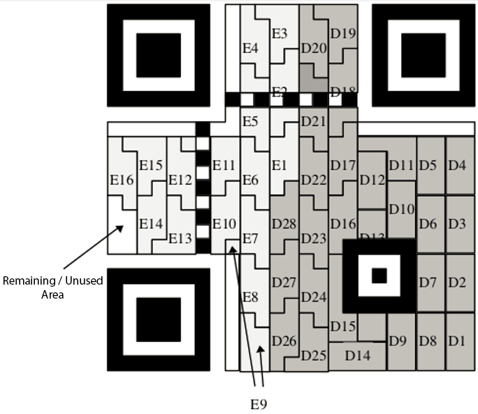

## Barcode

- Graphic identifier representing a set of information, consisting of black bars and white spaces of unequal width, arranged according to different code formats
- International standards
- EAN-13 used to identify a specific retail product type, 13 digits
- Code 39 used in industrial applications, 39 characters
- Code 128 used in the health industry, blood banking, and electronics manufacture, 128 characters
- [Online Barcode Reader](https://online-barcode-reader.inliteresearch.com/)

## QR code

- A black and white graphic that records the data symbol information according to certain rules with a specific geometric figure
- Recording data symbol information in a black and white pattern in a step-by-step manner with a certain geometry
- Stacked/Row QR Code: Code 16K, Code 49, PDF417
- Matrix QR Code: QR Code

    

    
