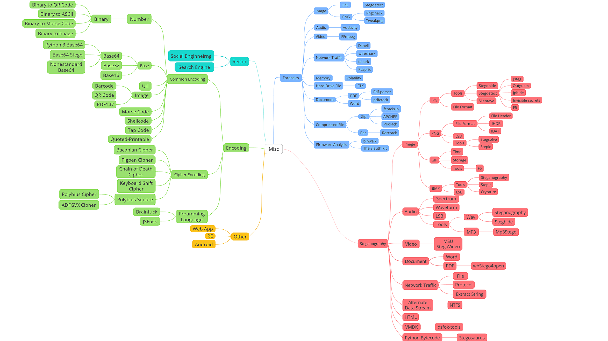

Misc is an abbreviation for Miscellaneous

The Misc category typically contains the following topics:

-   Recon

-   Forensics

-   Stego

-   Misc

-   ……

The Misc category can sometimes include crypto (especially classic ciphers).

In this section on Misc, we will go over the following topics:

- Recon (Information Gathering)

Introduces ways to obtaining information and some tips on using search engines such as Google.

- Encodings (Encoding Conversion)

Introduces some common encoding formats and conversion methods.

- Forensic &amp;&amp; Stego

Steganography and Forensics involve clever encoding, hidden data, nested files, using search engines to obtain information, and so on. Topics covered are file analysis, memory image analysis, network traffic analysis, and etc.

Forensics is different in the real world. In the real world, it rarely involves clever encoding, hidden data, strings scattered and nested in files. But rather it involves mostly recovering data from a damaged file, finding evidence in a broken disk image, or extracting useful information from a memory/disk image.

Real-world forensics requires you to find evidence of a malicious act: an attacker attacking the system or insider threat behavior by analyzing logs, memory, file system to find out the relationship between the files or data.

Misc is the perfect entry point for CTF competition since it can help you discover and develop different interests. Misc requires various understanding and skills in security and creative thinking.

